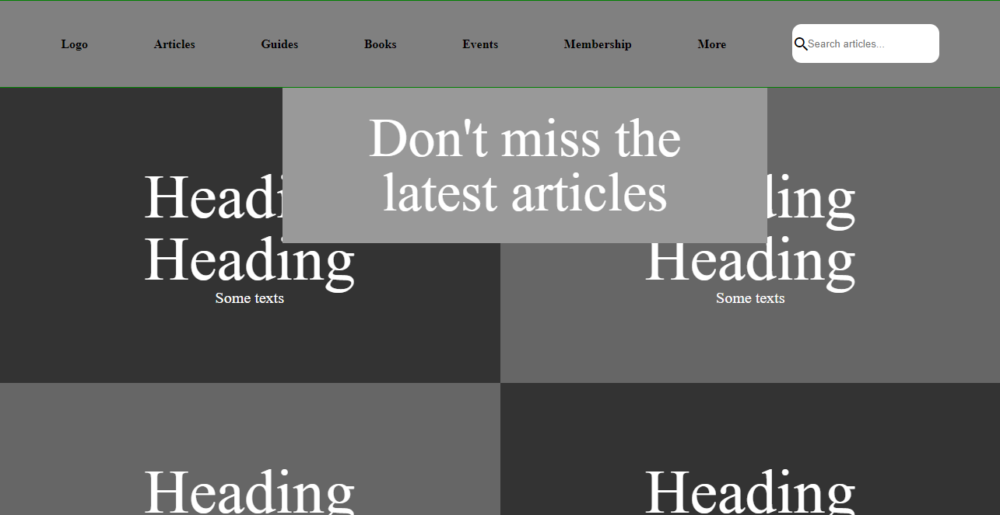
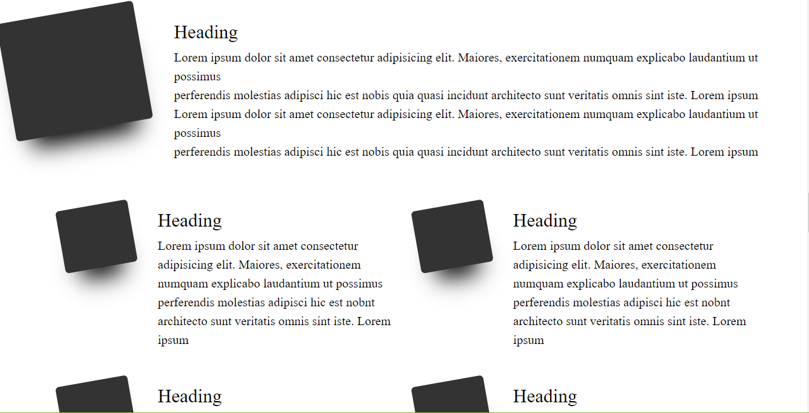
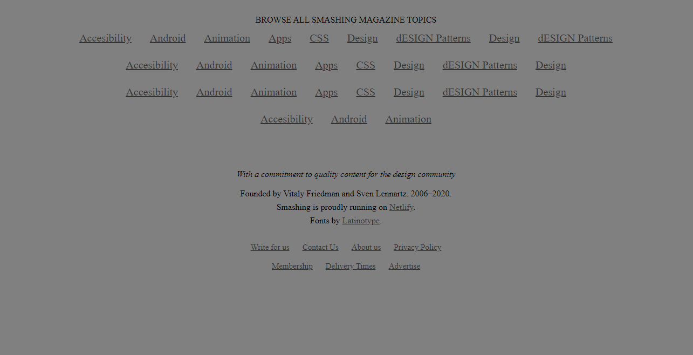

# Project 5 - Design Teardown

This is an assigned collaborative project where we had to use Google Web Fonts and apply grey colored backgrounds to sections of the webpage in order to apply our knowledge on visual hierachies and design. We are cloning the 
<a href="https://www.smashingmagazine.com/">Smashing Magazine website.</a>

## Preview of webpage

### Top of webpage



### Middle of webpage



### Bottom of webpage



## Built With

- HTML5
- CSS3
- Google Web Fonts

## Live Demo

[Live Demo Link](https://raw.githack.com/chelmerrox/Project-5-Design-Teardown/project-draft/index.html)


## Getting Started


To get a local copy up and running follow these simple example steps.

## How To Use 🔧

From your command line, first clone the project:

```bash
# Clone this repository
$ git clone https://github.com/chelmerrox/Project-5-Design-Teardown

# Go into the repository
$ cd Project-5-Design-Teardown

$ run live server

```

## Authors

👤 **Losalini Rokocakau**

- Github: [@chelmerrox](https://github.com/chelmerrox)
- Twitter: [@chelmerrox](https://twitter.com/chelmerrox)
- Linkedin: [Losalini Rokocakau](https://linkedin.com/losalini-rokocakau)

👤 **Paul Ogolla**

- Github: [@githubhandle](https://github.com/paulzay)
- Twitter: [@twitterhandle](https://twitter.com/_paulzay_)
- Linkedin: [linkedin](https://www.linkedin.com/in/paulogolla/)

## 🤝 Contributing

Contributions, issues and feature requests are welcome!

Feel free to check the [issues page](https://github.com/chelmerrox/Project-5-Design-Teardown/issues).

## Show your support

Give a ⭐️ if you like this project!

## Acknowledgments

- Special thanks to Microverse and the Odin Project

## 📝 License

This project is [MIT](lic.url) licensed.
